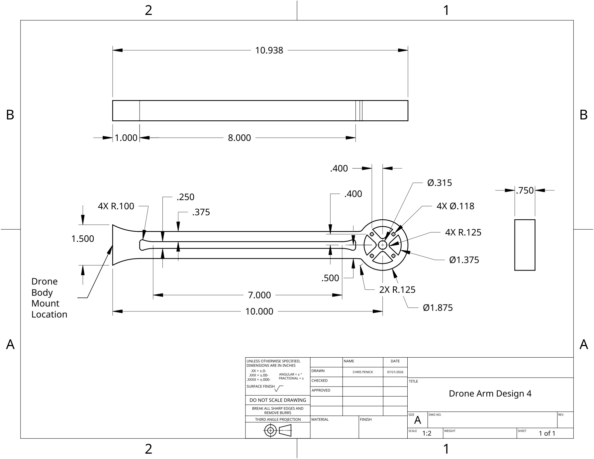
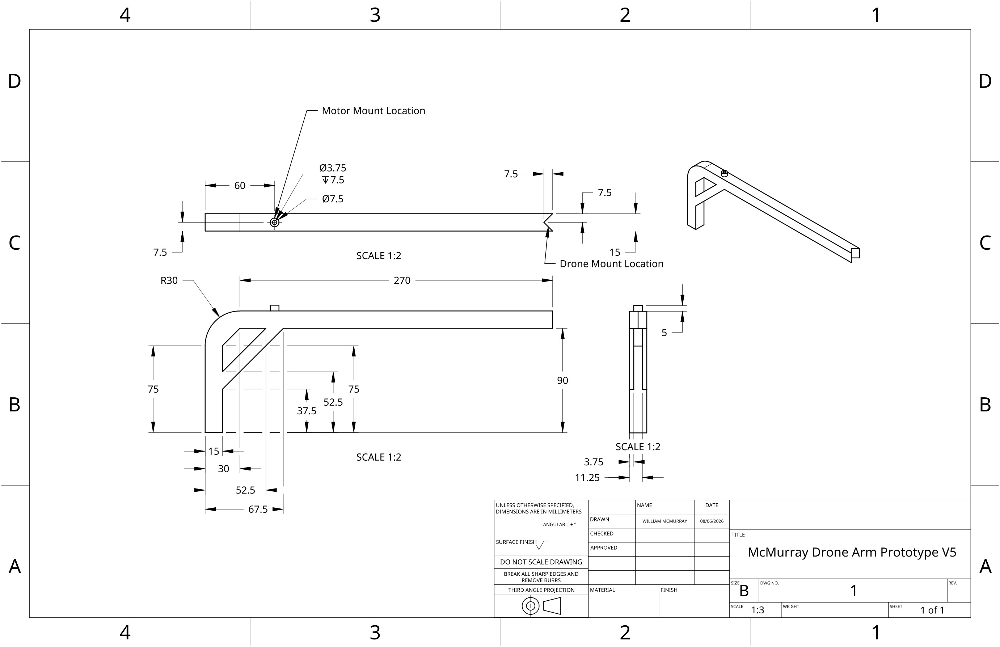
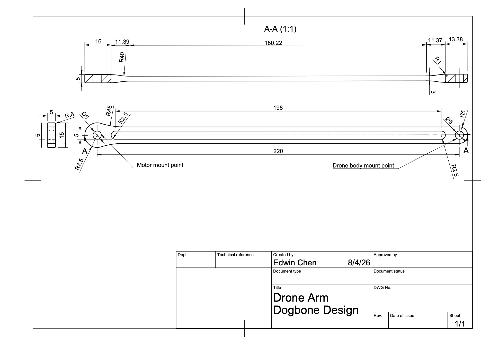

<table>
<td></td>
<td>
<h1>Drone Payload Capacity and Structural Design Analysis</h1>

Team 5: Chris Penick, Edwin Chen, Juan Gonzales, William McMurray

</table>

## Objective
The objective of this project is to test different drone arm designs and material options for a quadcopter drone. The goal is to maximize payload capacity while maintaining structural integrity under motor induced loads. MATLAB will be used to perform thrust-to-weight analysis and finite element analysis to compare each design and material combination, allowing us to choose the best design that meets the design requirements.
## How to Run the Code
### Instructions
1. Download the `.zip` of the repository’s main branch
2. Unzip `drone-team-5.zip` using a data compressor tool such as 7-Zip, WinRAR, or any software of your choice
3. Open the live script, `drone-team-5.mlx`, using MATLAB
4. Verify that the current directory is set to the project root folder by typing `cd` into the command window.
5. Verify that all of the `.stl` files are placed in the `/resource/stl` folder so it can be read by the program
6. Run the live script once so the `.stl` files can be read by the program and be saved to memory
7. Select the drone arm design `.stl` file for the FEA and run section
8. Identify and write down the drone arm’s static and loading face IDs for FEA
9. Run the FEA section to perform FEA

### Dependencies
* The Partial Differential Equation Toolbox is required
* For best results, use MATLAB 2026a

### Troubleshooting
* If the “Visualize PDE Results” task at the end of the live script doesn’t display correctly after running the entire live script, verify that the Partial Differential Equation Toolbox is installed and restart MATLAB.
* If the live script throws an error, `Index exceeds array bounds.`, verify that the current directory is set to the project root folder by typing `cd` into the command window. The current directory must be set to the project root folder for the live script to read the `.stl` files located in `resource/stl`.
* If `droneArmMaterials.mat` isn’t loading when you run the live script, verify that it’s located in the resources folder of the project root.

## Plan
### Requirements
* Design and model two or more drone arms for a quadcopter drone
* With given material options, perform thrust to weight analysis across each option to see which material optimizes payload capacity while meeting safety requirements
* Perform finite element analysis on each drone arm’s 3D model in the form of an `.stl` file in MATLAB from a combination of upward motor thrust force and downward motor weight force to obtain its maximum von Mises stress, displacement, and safety factor.
* Compare and contrast material options to see which arm meets the design requirements based on the Von mises stresses, displacements, and safety factor from the FEA

### Constraints
* Safety factor must be at least 1.5
* Assuming 1kg of thrust per motor, drone must be able to support a minimum 0.5kg payload
* Thrust to weight ratio must be at least 2:1

### Success Criteria
* At least two drone design sketches showing key geometric features
* Results of thrust-to-weight analysis presented either in a summary table or plot
* Results of finite element analysis
  * Numerical values presented in a summary table
  * Visualizations of x-, y-, and z-displacement and Von Mises stress
* A final design recommendation justified using the results of your analyses

### Proposed Solution
We propose to make a MATLAB live script that can automatically analyze multiple drone arm designs in the form of `.stl` files, allowing the user to know each design’s maximum payload, average material cost, and structural integrity under motor-induced loads for each user-defined material combination.

### Implementation Steps
1. Gather starter assumptions and define material properties into MATLAB
2. Develop at least two distinct drone arm designs by drawing clear, neatly labeled sketches that show key geometric features
3. Perform a thrust-to-weight analysis across all design and material options to evaluate which drone arm design and which material optimizes payload capacity while meeting suggested safety requirements
4. Perform finite element analysis (FEA) across all design and material options to evaluate the structural safety factor of your drone arm design. (To simplify the task, we will perform the FEA only on a single drone arm.)
5. Using the results of both the thrust-to-weight analysis and finite element analysis, propose a final design solution for the drone arm that maximizes payload capacity while meeting safe flight standards and maintaining structural integrity under load

### Challenges
* Creating a real-life scale drone arm in CAD
* Creating a user-interactible live script in MATLAB that meets all of the design requirements
* Presenting data in a user-friendly format in MATLAB
* Troubleshooting code issues
* Coordinating with teammates and effectively using GitHub

## Designs
### Chris’s Design: chris_final_drone_arm

I chose a design that was a solid beam with a cutout slot in the middle to reduce the weight and increase the airflow through the arm. I chose to do a solid design to minimize complexity while also ensuring that it would be strong enough to support the payload and the thrust from the motor. I designed the length of the drone arm to be 280 mm in order to be long enough to support propellers of 127 mm (5 inches), which would be long enough to lift the body of the drone and payload. When loaded the beam will perform well and not undergo much displacement with most of the materials. PLA will have the most displacement due to the softness of the plastic.

### Will’s Design: McMurray_DroneArmPrototypeV5

My design is a long drone arm that bends down into the leg with a fillet on the outside and a chamfer on the inside in order to remove and distribute any additional stress that might result from sharp corners. An additional pair of ribs connect the arm and leg for additional stability to support the arm that will attach to the drone holding the payload. The motor mount extends out from the arm cylindrically and has a smaller 3.75mm cylindrical hole for the motor to be placed in. The drone arms will mount to each of the four corners of a square shaped drone body and will extrude diagonal to each face of the body. Under the load of the motor, the diagonal beam connecting the arm and the leg will take away some of the stress from going to the long arm. However, PLA plastic will provide the least effective arm in terms of displacement because of its high elasticity and low strength.

### Edwin’s Design: DroneArm_Dogbone

This drone arm design is a narrow and solid beam with dimensions similar to what’s expected for a fast-flying FPV drone. I chose this design because the cut and slimming taper in the middle will save weight and material, while the motor and drone body mount points’ has extra material to increase the amount of threading available and act as additional reinforcement to improve long-term durability (The dogbone name comes from the middle taper in the drone arm’s side profile). Sharp corners were eliminated through filet operations to decrease stress concentrations, giving it a round design. Even so, this arm design will suffer from bending and torsional stresses under a motor’s load because of the lack of material and bracing in the arm’s tapered portion. Therefore, this design warrants the usage of a very stiff material like a carbon-fiber reinforced polymer composite to minimize the bending and torsional stresses and maximize its effectiveness.

## Interpretation of Results
### Final Recommended Design Solution
Based on our data, we recommend the usage of `chris_final_drone_arm` made with birch wood to be used as a drone arm. The design exceeds the minimum 0.5kg payload capacity with a payload capacity of 0.92kg; exceeds the recommended safety factor range of 1.5-2 by having a safety factor of 2.2; and has the lowest material cost of $0.06 out of our material options, with the average material cost of $0.32 and the most expensive material option being $0.95 for a carbon fiber polymer composite. However, the arm has a maximum displacement of 22mm, considerably higher than aluminum alloy and carbon fiber polymer composite’s maximum displacement of 3mm. Despite the high displacement, the birch wood drone arm still exceeds the recommended safety factor range, allowing us to still consider the usage of that material for a drone arm.

In contrast, `DroneArm_Dogbone` made with carbon fiber reinforced polymer was our second-best option: It has a 0.97kg payload capacity, a safety factor of 1.7, costs $0.49 in material, and has a maximum displacement of 47mm. Despite the slightly higher payload capacity, the dogbone design comes with too many drawbacks compared to `chris_drone_arm_v3`. The safety factor, maximum displacement, and material cost was considerably worse than `chris_final_drone_arm` made of birch wood, despite the use of a premium engineering material, so we ruled out `DroneArm_Dogbone`.

Thus, `chris_final_drone_arm` made of birch wood is the most feasible drone arm design that we’ve analyzed. The design’s high cost efficiency makes it very suitable to mass produce for low-cost drone units.

### Limitations
Generally, simulations can only predict reality through approximations, but cannot accurately reproduce it. In a similar manner, the FEA results will deviate from the drone arm’s real-world behavior due to the assumptions and scope we worked with.

For example, the FEA doesn’t take the material’s manufacturing process into consideration. If the drone arm was made through FDM 3D printing, then its structural characteristics will be anisotropic, while producing the drone arm through subtractive manufacturing techniques like CNC or injection molding would give it isotropic structural characteristics. While it’s true that there could also be defects from its manufacturing process that can lower the arm’s actual yield strength from the theoretical, taking the drone arm’s safety factor into account during our analysis compensates for that. Altogether, our FEA most accurately reflects the structural characteristics of a drone arm not made from FDM 3D printing because our solution doesn’t take anisotropy into account.

Additionally, our FEA solution doesn’t account for the vibration and variable loading from real-world operating conditions. Throughout its service life, the drone would likely go through hard acceleration from takeoff and corrective maneuvers, subjecting the drone arm to cyclic stresses. The cyclic stresses will cause fatigue and increase the likelihood of failure over time. Meanwhile, propellers can cause resonance from motor harmonics within the drone body during usage. If a propeller vibrates a drone arm close to its natural frequency, it can compound its likelihood for failure, especially if the drone has gone through a substantial number of loading cycles. Because of that, our work is best for predicting a drone arm’s short-term performance from a static load and further work will be needed to predict the longer-term durability of our drone arm.

Additionally, the design cost analysis doesn’t take the manufacturing process into consideration, but rather the cost of the raw material for the drone arm volume. While it’s true that the manufacturing expenses are indirectly reflected in the relative cost differences of each material selection, each of our proposed designs have unique geometry and pose different types of manufacturing challenges that indirectly increase the overall cost of the design. In other words, two different drone arm designs made with the same material with the same volume as each other will likely have different costs because, for example, one design might be more complex to machine than the other.

### Practical Next Steps
After the FEA step, we will go back to the CAD phase and model real-world threads and ensure enough clearance for our electronic components. We will also verify that our design would be manufacturable with the manufacturing technique that we’ve loosely considered while creating our first design drafts. For example, since our drone arm will be made of birch wood, we’ll have to verify if we’re able to recreate our geometry visualized in the CAD phase given the tooling available for making a wood component.

Next, we’ll build real-world prototypes of our drone. Our first prototype will be quickly 3D printed with PLA or ABS plastic or laser cut to verify fitment and clearance of all of our components, but it won’t actually be functional. Afterwards, we will build the drone arm out of our chosen material to conduct laboratory tests to verify the FEA results. We will also test for motor harmonics, which our FEA solution doesn’t cover.

If real-world tests verify that our drone arm design meets our design specifications with the entire drone, we will create the bill of materials and engineering drawings with GD&T so the drone can be mass-produced by suppliers.
